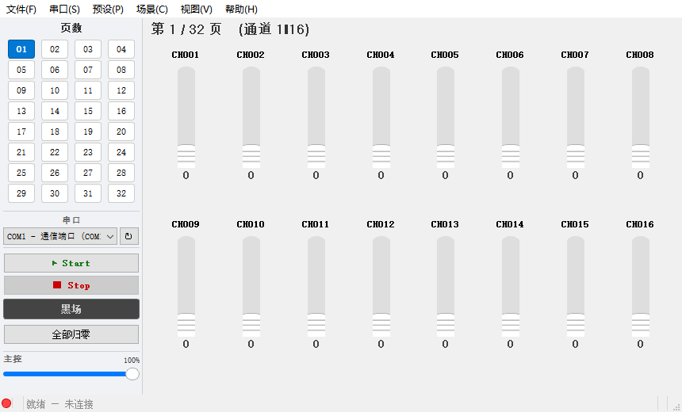

# DMX 调试助手

> 基于 Python + PyQt5 的 DMX512 灯光控制工具，通过 USB 转串口模块（RS-485）输出标准 DMX512 协议信号。



## 功能特性

- **512 通道控制** — 全 DMX512 通道，分 32 页显示（每页 2×8 推杆网格）
- **物理推杆风格** — iOS 式白色滑块 + 握持纹，双击数值可直接键入 0-255
- **主控推子** — 全局 0-100% 输出缩放，不破坏原始存储值
- **黑场一键切换** — Space/B 快捷键，红色警示，恢复时保留原始值
- **通道编组** — Ctrl+多选，同步调节编组内所有通道
- **通道命名** — 右键重命名，自定义名称随场景保存
- **通道锁定** — 锁定后滑块禁用，批量操作自动跳过
- **场景库** — 内置多场景管理（保存/加载/重命名/删除），JSON 本地存储
- **场景轮巡** — 勾选场景，设置停留时间和淡入淡出时长，循环自动切换
- **全部归零 / 最大 / 取反** — 跳过锁定通道，安全批量操作
- **帧率显示** — 状态栏实时显示 DMX 帧率

## 硬件背景

### 什么是 DMX512？

DMX512（Digital Multiplex with 512 channels）是舞台灯光领域最广泛使用的数字通信协议，由 USITT（美国剧院技术协会）制定。它采用差分信号传输（RS-485 物理层），具有抗干扰强、传输距离远的优点。

**协议参数：**
| 参数 | 值 |
|------|-----|
| 波特率 | 250,000 bps |
| 数据位 | 8 |
| 停止位 | 2 |
| 校验 | 无 |
| 物理层 | RS-485 差分信号 |
| 通道数 | 512（每个 0-255） |
| 帧率 | ~36 fps |

**帧结构：**
```
┌───────┬──────┬──────────┬─────────────────────────────────┐
│ Break │ MAB  │ Start    │ Channel Data (512 bytes)        │
│ ≥88μs │ ≥8μs │ Code 0x00│ Ch1 │ Ch2 │ Ch3 │ ... │ Ch512  │
└───────┴──────┴──────────┴─────────────────────────────────┘
```

### 所需硬件

1. **USB 转 RS-485 模块**（如 FTDI FT232RL + MAX485、CH340G + MAX485 等）
2. **DMX512 灯具或解码器**（LED PAR 灯、摇头灯、调光器、LED 控制器等）
3. **杜邦线 / 接线端子** — RS-485 模块到灯具的接线

**接线方法：**
```
USB 转 RS-485 模块          DMX512 设备
┌─────────────┐           ┌────────────┐
│     A (+)   ├───────────┤ DATA+ (Pin 3)│
│     B (-)   ├───────────┤ DATA- (Pin 2)│
│     GND     ├───────────┤ GND   (Pin 1)│
└─────────────┘           └────────────┘
```

> 注意：DMX512 总线需要在末端连接一个 120Ω 终端电阻，以防止信号反射。

## 安装

### 环境要求

- Python 3.9+
- Windows / macOS / Linux

### 步骤

```bash
# 克隆仓库
git clone https://github.com/your-username/dmx512_controller.git
cd dmx512_controller

# 安装依赖
pip install -r requirements.txt

# 运行
python main.py
```

### 构建单文件 exe

```bash
pip install pyinstaller
pyinstaller --onefile --windowed -y --icon icon.ico --name "DMX调试助手" main.py
```

构建产物在 `dist/DMX调试助手/DMX调试助手.exe`。

## 使用指南

### 基本操作

1. 将 USB 转 RS-485 模块连接到电脑
2. 在左侧「串口」下拉选择端口（点击 ↻ 刷新）
3. 点击「▶ Start」开始发送 DMX 信号
4. 拖动通道滑块控制灯具亮度（0-255）
5. 点击「■ Stop」停止发送

### 通道控制

- **拖动滑块** — 实时调节通道值
- **双击数值** — 弹出输入框，直接键入 0-255
- **点击通道号** — 选中通道（蓝色高亮）
- **Ctrl+点击** — 多选编组
- **右键菜单** — 重命名 / 锁定 / 归零

### 页面切换

- 左侧 4×8 网格按钮快速跳转
- 当前页高亮显示

### 菜单功能

| 菜单 | 功能 | 快捷键 |
|------|------|--------|
| 文件 → 新建场景 | 清除所有通道数据 | Ctrl+N |
| 文件 → 打开场景 | 加载 .dmx / .json 场景文件 | Ctrl+O |
| 文件 → 保存场景 | 保存当前场景 | Ctrl+S |
| 文件 → 另存为 | 另存场景文件 | Ctrl+Shift+S |
| 串口 → 刷新端口 | 重新扫描可用串口 | F5 |
| 预设 → 全部归零 | 所有通道归零（跳过锁定） | Ctrl+R |
| 预设 → 全部最大 | 所有通道设为 255 | — |
| 预设 → 全部取反 | 通道值翻转（0↔255） | — |
| 场景 → 场景库 | 内置多场景管理器 | Ctrl+L |
| 场景 → 场景轮巡 | 自动切换场景序列 | — |

## 项目结构

```
dmx512_controller/
├── main.py                  # 程序入口
├── requirements.txt         # 依赖清单 (PyQt5, pyserial)
├── icon.ico                 # 应用程序图标
├── build.py                 # 构建脚本
├── build_icon.py            # 图标生成脚本
├── CLAUDE.md                # AI 辅助开发文档
├── SPEC.md                  # 详细规格说明（中文）
│
├── src/
│   ├── __init__.py
│   │
│   ├── dmx/
│   │   ├── __init__.py
│   │   └── transmitter.py   # DMX512 协议发送线程
│   │
│   ├── engine/
│   │   ├── __init__.py
│   │   └── chaser.py        # 场景轮巡引擎（QThread + 淡入淡出）
│   │
│   └── ui/
│       ├── __init__.py
│       ├── main_window.py   # 主窗口
│       ├── page_widget.py   # 单页控件（2×8 网格 + 编组同步）
│       ├── channel_widget.py# 单通道控件（滑块 + 标签 + 选中 + 锁定）
│       ├── scene_library.py # 场景库对话框
│       ├── chaser_panel.py  # 场景轮巡控制面板
│       └── serial_panel.py  # 串口面板（保留备用）
│
└── scenes/
    └── scenes.json          # 场景库数据（自动生成）
```

## 技术架构

### 数据流

```
UI 滑块拖动
    ↓
update_channel(ch, val)  →  dmx_data (bytearray[512])
                                    ↓
                        DMXTransmitter (QThread)
                                    ↓
                        serial: break(100μs) + MAB(12μs) + write(513 bytes)
                                    ↓
                            DMX512 帧 → RS-485 → 灯具
```

### 线程模型

- **主线程（UI）** — PyQt5 事件循环，所有界面操作
- **DMXTransmitter（QThread）** — 持续循环发送 DMX 帧，~36fps
- **ChaserEngine（QThread）** — 场景轮巡时按序切换、插值淡入淡出

### 错误恢复机制

- 连续 3 次发送失败 → 自动停止发送线程
- USB 拔出检测 → Windows 错误码 1167 (ERROR_DEVICE_REMOVED)
- 串口消失检测 → Windows 错误码 2 (ERROR_FILE_NOT_FOUND)

### DMX 帧时序实现

采用 `time.perf_counter()` 自旋等待实现微秒级精度，因为 Windows 默认定时器分辨率仅 ~15.6ms。Break 信号通过 `serial.break_condition` 属性手动控制（`send_break()` 精度不足）。

## 开发

```bash
# 安装开发依赖
pip install -r requirements.txt

# 运行
python main.py

# 构建 exe
python build.py
```

## 许可

本项目基于 [MIT License](LICENSE) 开源。

## 致谢

- [PyQt5](https://www.riverbankcomputing.com/software/pyqt/) — Python Qt 绑定
- [pyserial](https://github.com/pyserial/pyserial) — Python 串口库
- [USITT DMX512-A](https://tsp.esta.org/tsp/documents/published_docs.php) — DMX512 标准文档

---

**免责声明：** 本工具用于合法的灯光控制场景。使用者应遵守所在地关于无线电/通信设备的相关法律法规。
